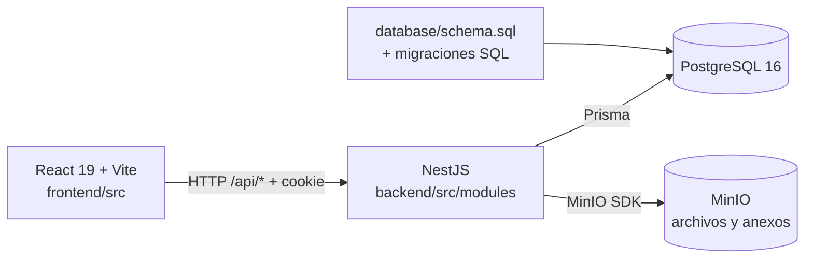

# CEISH Platform

Plataforma institucional para recibir, estratificar y evaluar investigaciones del CEISH. La interfaz ofrece flujos para investigadores, miembros evaluadores y administradores.

## Arquitectura

El monorepo mantiene la aplicación React/Vite y la API NestJS en paquetes separados. El navegador habla con la API mediante `/api/*`; solo el backend accede a PostgreSQL y MinIO.



El frontend conserva los contratos consumidos desde `frontend/src/services/`. En desarrollo, Vite reenvía `/api` a NestJS cuando `VITE_USE_NEST_BACKEND=true`. El antiguo plugin `frontend/src/server/apiPlugin.ts` sigue disponible como transición local, pero NestJS es la implementación de referencia y la configuración de ejemplo usa NestJS.

### Estructura y responsabilidades

```text
frontend/                    Aplicación React/Vite
├── src/                     Rutas, vistas, servicios y API Vite transitoria
├── public/                  Recursos estáticos
├── package.json             Scripts y dependencias del frontend
└── vite.config.ts           Proxy local hacia la API NestJS
backend/                     API NestJS
├── prisma/schema.prisma     Modelos de PostgreSQL
└── src/                     Guards, utilidades y módulos de dominio
    ├── common/              Auth, validación, Prisma y MinIO
    └── modules/             Auth, users, submissions, reviews y CEISH
database/                    Esquema inicial, seed y migraciones SQL incrementales
docs/                        Arquitectura, ejecución y matrices de revisión
```

Las migraciones aplicadas no se editan: los cambios de esquema se agregan con un nuevo archivo numerado en `database/migrations/` y se reflejan en `database/schema.sql`. NestJS usa Prisma para consultar el esquema compartido. Los contratos actuales de `/api/*` deben mantenerse durante la transición de servicios.

### Límites entre módulos

| Módulo | Responsabilidad |
| --- | --- |
| `auth` | Login, registro, sesión y revisión de solicitudes |
| `users` | Perfiles y listados limitados por rol y asignación |
| `submissions` | Entregas, documentos y flujos de revisión |
| `stratification` | Asignación CEISH, conflicto y Anexo 27 |
| `qualification` | Checklist Anexo 12, correcciones y ciclos de evaluación |
| `reviews` | Revisión académica por etapas |
| `annexes` | Emisión y descarga de documentos institucionales |
| `admin` | Supervisión y asignaciones administrativas |

Las contraseñas se guardan con `scrypt`. La sesión se transporta en una cookie firmada `HttpOnly`, `SameSite=Lax` y `Secure` en producción; cada solicitud protegida vuelve a consultar el usuario y rol vigentes. Los permisos se aplican en NestJS, además de cualquier restricción visual del frontend.

## Requisitos

- Node.js 20.19+ o 22.12+
- npm
- Docker Compose para PostgreSQL y MinIO

## Ejecutar localmente

1. Copia `.env.example` a `.env` y configura una clave secreta única para `SESSION_SECRET`. Vite lee el archivo de entorno desde la raíz.
2. Instala las dependencias en cada paquete. Ejecuta cada grupo desde la raíz en una terminal separada:

   ```bash
   cd frontend
   npm ci
   ```

   ```bash
   cd backend
   npm ci
   npx prisma generate
   ```

3. Inicia PostgreSQL, MinIO y NestJS:

   ```bash
   docker compose up -d postgres minio
   ```

   ```bash
   cd backend
   npm run start:dev
   ```

   El backend escucha en `http://localhost:3000`; Swagger está en `http://localhost:3000/api/docs`.

4. En otra terminal, desde la raíz del repositorio, inicia React/Vite:

   ```bash
   cd frontend
   npm run dev
   ```

   Abre `http://localhost:5173`. La configuración de ejemplo activa el proxy hacia NestJS. Si se levanta toda la infraestructura con `docker compose up -d`, el servicio `backend` también se inicia dentro de Docker.

Docker ejecuta `database/schema.sql` y `database/seed.sql` únicamente al crear un volumen PostgreSQL vacío. Para una base existente, aplica las migraciones pendientes con `node scripts/migrate.mjs` desde la raíz.

## Configuración

Las variables principales están en `.env.example`; `backend/.env.example` documenta valores para ejecutar NestJS fuera de Docker. Dentro de Compose, el backend usa los nombres de servicio `postgres` y `minio`. En producción se deben establecer `SESSION_SECRET` (aleatorio, 32 caracteres o más), `DATABASE_PASSWORD`, claves de MinIO y `CORS_ORIGIN` explícitos; no se deben reutilizar las credenciales de demostración.

| Variable | Uso |
| --- | --- |
| `VITE_USE_NEST_BACKEND` | Activa el proxy `/api` desde Vite a NestJS |
| `BACKEND_URL` | Destino del proxy local, por defecto `http://localhost:3000` |
| `DATABASE_URL` | Conexión Prisma a PostgreSQL |
| `SESSION_SECRET` | Firma de cookies de sesión |
| `CORS_ORIGIN` | Origen del frontend autorizado por NestJS |
| `MINIO_ENDPOINT`, `MINIO_PORT` | Conexión del backend al almacenamiento |
| `UPLOAD_MAX_MB` | Límite de tamaño de carga |

## Comandos útiles

```bash
cd frontend; npm run dev     # Frontend Vite
cd frontend; npm run build   # TypeScript y build frontend
cd frontend; npm run lint    # ESLint frontend
cd backend; npm run build    # Build NestJS
cd backend; npm run lint     # ESLint NestJS
cd backend; npm test         # Pruebas de autenticación
docker compose up -d        # PostgreSQL, MinIO y API NestJS
docker compose down         # Detiene servicios, conserva volúmenes
```

El comando `docker compose down -v` elimina los volúmenes de datos y reinicia el seed; úsalo solo cuando quieras descartar esos datos locales.

## Flujos principales

- **Investigador:** solicita registro; tras aprobación puede gestionar perfil e investigaciones, enviar documentos y responder solicitudes de corrección.
- **Evaluador / miembro CEISH:** accede a las investigaciones asignadas, registra estratificación, emite anexos y revisa documentos.
- **Administrador:** revisa solicitudes de registro, gestiona usuarios y asignaciones, y supervisa el flujo institucional.

Las pantallas y rutas están centralizadas en `frontend/src/app/router/index.tsx`. Los componentes consultan servicios de `frontend/src/services/`; no ejecutan consultas SQL ni acceden a MinIO. Los archivos permanecen en MinIO y PostgreSQL conserva sus metadatos y rutas.

## Convenciones de trabajo

- Trabaja en una rama enfocada (`feature/`, `fix/` o `docs/`) y no desarrolles directamente en `master` o `develop`.
- Conserva el contrato de respuesta y las rutas existentes al mover lógica al backend.
- Valida entradas y permisos en el servidor. El rol y la relación del usuario con la investigación se comprueban antes de devolver datos.
- Usa DTOs validados en NestJS y mantiene las respuestas de error legibles por los servicios del frontend.
- Documenta cambios de API o esquema y agrega migraciones SQL nuevas; no edites migraciones ya aplicadas.
- Ejecuta lint y build de ambos paquetes antes de solicitar revisión.

## Documentación

- [Guía de integración y ejecución](docs/guia_integracion_y_ejecucion.md)
- [Guía del sistema visual](docs/sistema-visual.md)
- [Matriz de autenticación y autorización](docs/matriz-seguridad-auth.md)
- [Flujo institucional de anexos](contexto/flujo-anexos-evaluacion.md)
