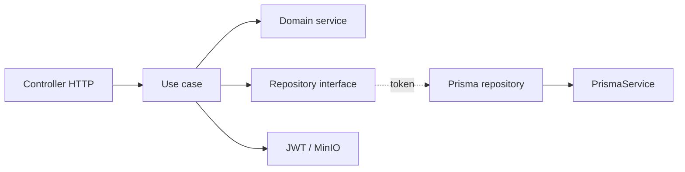

# Arquitectura del backend CEISH Platform

## Objetivo

El backend implementa la API de CEISH Platform con NestJS, Prisma y PostgreSQL. Su organización sigue una separación inspirada en Clean Architecture: las reglas de negocio se mantienen aisladas de HTTP, Prisma y MinIO, y cada módulo representa una capacidad del sistema.

El sistema no es un CRUD convencional. Las operaciones importantes cambian estados, validan permisos, preservan historial y generan eventos en `workflow_events`.

## Tecnologías

| Responsabilidad | Tecnología |
|---|---|
| API y contenedor de dependencias | NestJS 10 |
| Validación | `class-validator` y `class-transformer` |
| Persistencia | Prisma 5.22 + PostgreSQL 15 |
| Autenticación | Passport JWT + `bcrypt` |
| Archivos | MinIO |
| Documentación HTTP | Swagger/OpenAPI |
| Infraestructura local | Docker Compose |

## Estructura general

```text
backend/
├── .env.example                 # variables esperadas, sin secretos
├── package.json                 # scripts y dependencias
├── package-lock.json            # resolución exacta de dependencias
├── prisma/schema.prisma         # esquema usado por el backend
└── src/
    ├── main.ts                  # arranque HTTP
    ├── app.module.ts            # módulo raíz
    ├── commands/seed.ts         # datos de desarrollo idempotentes
    ├── common/                  # piezas compartidas
    └── modules/                 # módulos funcionales
```

`node_modules/`, `dist/` y `*.tsbuildinfo` son artefactos locales excluidos por `.gitignore`. Los archivos `.env` tampoco deben subirse al repositorio.

## Capas de un módulo

```text
modules/<feature>/
├── domain/
│   ├── entities/                # objetos de negocio
│   ├── repositories/            # contratos e tokens
│   └── services/                # reglas de dominio
├── application/
│   ├── dto/                     # entrada y salida de la API
│   └── use-cases/               # acciones de negocio
└── infrastructure/
    ├── controllers/             # adaptadores HTTP
    ├── repositories/            # implementaciones Prisma
    └── <feature>.module.ts      # inyección de dependencias
```



Los casos de uso dependen de interfaces, no de clases Prisma. El repositorio concreto se registra y luego se expone como alias con `useExisting`:

```ts
providers: [
  ConcreteRepository,
  { provide: REPOSITORY_TOKEN, useExisting: ConcreteRepository },
]
```

Esto permite que ambos tokens usen una sola instancia.

## Archivos raíz de `src`

### `main.ts`

Punto de entrada de NestJS. Importa `reflect-metadata`, crea la aplicación y configura el prefijo `api`, versionado URI `v1`, CORS, `ValidationPipe`, `HttpExceptionFilter` y Swagger en `/api/docs`.

### `app.module.ts`

Módulo raíz. Carga `ConfigModule` de forma global, `PrismaModule` y los módulos Auth, Users, Investigations, Risk Assessment, Evaluation, Annexes y Documents.

### `commands/seed.ts`

Comando idempotente de datos de desarrollo. Crea usuarios de prueba, tipos de investigación y las plantillas de anexos 12, 23 y 27. Las versiones y campos de cada plantilla se crean dentro de transacciones.

## Carpeta `common`

Contiene componentes reutilizables entre módulos; no debe contener reglas específicas de una sola funcionalidad.

| Archivo/carpeta | Propósito |
|---|---|
| `prisma/prisma.service.ts` | Cliente Prisma y ciclo de vida de la conexión. |
| `prisma/prisma.module.ts` | Módulo global que registra `PrismaService`. |
| `prisma/index.ts` | Barrel de Prisma. |
| `decorators/roles.decorator.ts` | Declara roles permitidos en metadata. |
| `decorators/current-user.decorator.ts` | Extrae el usuario autenticado. |
| `decorators/is-investigation-status.decorator.ts` | Declara estados permitidos para una acción. |
| `guards/roles.guard.ts` | Autoriza según roles declarados. |
| `filters/http-exception.filter.ts` | Normaliza errores HTTP. |
| `interceptors/workflow-event.interceptor.ts` | Registra eventos de auditoría para operaciones de escritura identificables. |
| `pipes/parse-investigation-status.pipe.ts` | Valida estados recibidos por HTTP. |
| `dto/pagination.dto.ts` | Parámetros comunes de paginación. |
| `enums/index.ts` | Roles, estados, tipos de documento y eventos de workflow. |
| `interfaces/api-response.interface.ts` | Contrato común de respuesta. |
| Archivos `index.ts` | Barrels para imports estables. |

## Módulo Auth

Ruta: `backend/src/modules/auth/`.

Gestiona registro, inicio de sesión, refresh tokens y cambio de contraseña.

- `domain/entities/user.entity.ts`: entidad de usuario de autenticación.
- `domain/repositories/user.repository.interface.ts`: contrato y token `USER_REPOSITORY`.
- `domain/services/auth-domain.service.ts`: reglas de autenticación.
- `application/dto/`: `register`, `login`, `refresh-token`, `change-password`, `token-response` y `user-info`.
- `application/use-cases/`: registro, login, refresh y cambio de contraseña.
- `infrastructure/controllers/auth.controller.ts`: endpoints `/auth/register`, `/auth/login`, `/auth/refresh` y `/auth/change-password`.
- `infrastructure/jwt.strategy.ts`: estrategia Passport para validar JWT.
- `infrastructure/repositories/user.prisma.repository.ts`: persistencia de usuarios.
- `infrastructure/auth.module.ts`: wiring de JWT, estrategia, controlador y repositorio.

## Módulo Users

Ruta: `backend/src/modules/users/`.

Administra cuentas y perfiles de investigadores y miembros CEISH.

- `domain/entities/user.entity.ts`, `domain/repositories/user.repository.interface.ts` y `domain/services/user-domain.service.ts`: modelo, contrato y reglas de usuario.
- `application/dto/`: consulta, aprobar, rechazar, suspender y actualizar perfiles.
- `application/use-cases/`: listar/consultar usuarios, aprobar, rechazar, suspender, actualizar perfil y listar miembros.
- `infrastructure/controllers/admin-user.controller.ts`: acciones administrativas.
- `infrastructure/controllers/user.controller.ts`: operaciones del usuario autenticado.
- `infrastructure/controllers/member.controller.ts`: consultas de miembros CEISH.
- `infrastructure/repositories/user.prisma.repository.ts`: implementación Prisma.
- `infrastructure/users.module.ts`: wiring del módulo.

## Módulo Investigations

Ruta: `backend/src/modules/investigations/`.

Gestiona investigaciones, participantes, revisión administrativa y máquina de estados.

- `domain/entities/investigation.entity.ts`: investigación y estado actual.
- `domain/entities/investigation-participant.entity.ts`: participante y rol principal.
- `domain/repositories/investigation.repository.interface.ts`: contrato de investigaciones y participantes.
- `domain/services/investigation-domain.service.ts`: transiciones válidas.
- `application/dto/`: creación, actualización, revisión, consulta y participantes.
- `application/use-cases/`: crear, actualizar, consultar/listar, enviar a revisión, revisar, agregar y quitar participantes.
- `infrastructure/controllers/investigator-investigation.controller.ts`: operaciones del investigador.
- `infrastructure/controllers/admin-investigation.controller.ts`: revisión administrativa.
- `infrastructure/repositories/investigation.prisma.repository.ts`: persistencia Prisma.
- `infrastructure/investigations.module.ts`: wiring del módulo.

## Módulo Risk Assessment

Ruta: `backend/src/modules/risk-assessment/`.

Implementa estratificación de riesgo, asignación de miembros y reestratificación con historial.

- `domain/entities/risk-assessment.entity.ts` y `risk-assessment-member.entity.ts`: assessment y asignación.
- `domain/repositories/risk-assessment.repository.interface.ts`: contrato de persistencia.
- `domain/services/risk-assessment-domain.service.ts`: reglas y transiciones.
- `application/dto/`: creación, asignación, envío, revisión y reestratificación.
- `application/use-cases/`: crear, asignar, enviar, revisar, consultar, listar asignados e historial.
- `infrastructure/controllers/admin-stratification.controller.ts`: acciones administrativas.
- `infrastructure/controllers/stratifier.controller.ts`: acciones del estratificador.
- `infrastructure/repositories/risk-assessment.prisma.repository.ts`: persistencia Prisma.
- `infrastructure/risk-assessment.module.ts`: wiring del módulo.

Las evaluaciones reemplazadas se conservan con estado `REPLACED`; no se borran.

## Módulo Evaluation

Ruta: `backend/src/modules/evaluation/`.

Contiene el proceso de evaluación, asignaciones, conflictos, observaciones y correcciones.

- `domain/entities/entities.ts`: definiciones compartidas de entidades.
- Entidades individuales: `evaluation`, `evaluation-process`, `evaluation-assignment`, `conflict-declaration`, `observation` y `correction-round`.
- `domain/repositories/evaluation.repository.interface.ts`: contrato y token del repositorio.
- `domain/services/evaluation-domain.service.ts`: reglas de transición.
- `application/dto/dtos.ts`: DTOs; los archivos individuales reexportan las clases para imports explícitos.
- `application/use-cases/use-cases.ts`: implementaciones; los archivos individuales son puntos de entrada por caso de uso.
- Casos de uso: asignar evaluadores, declarar conflicto, enviar evaluación, agregar observaciones, abrir/enviar/cerrar correcciones y consultar proceso/asignaciones.
- `infrastructure/controllers/admin-evaluation.controller.ts`: acciones administrativas.
- `infrastructure/controllers/evaluator.controller.ts`: acciones del evaluador.
- `infrastructure/repositories/evaluation.prisma.repository.ts`: persistencia Prisma.
- `infrastructure/evaluation.module.ts`: wiring del módulo.

Compila correctamente, pero requiere pruebas e2e de todas las transiciones y reglas de conflicto antes de producción.

## Módulo Annexes

Ruta: `backend/src/modules/annexes/`.

Administra plantillas versionadas, campos, anexos de investigaciones y respuestas.

- `domain/entities/annex.entity.ts`: entidades de plantillas, versiones, campos, anexos y respuestas.
- `domain/repositories/annex.repository.interface.ts`: contrato de persistencia.
- `domain/services/annex-domain.service.ts`: validaciones y versionado.
- `application/dto/dtos.ts`: DTOs del módulo.
- `application/use-cases/use-cases.ts`: casos de uso de plantillas, versiones, campos y respuestas.
- `infrastructure/repositories/annex.prisma.repository.ts`: implementación Prisma.
- `infrastructure/annexes.module.ts`: wiring del repositorio y casos de uso.

La base de dominio y persistencia está creada. Falta completar y probar los controladores administrativos, de investigadores y de evaluación, junto con sus autorizaciones.

## Módulo Documents

Ruta: `backend/src/modules/documents/`.

Gestiona metadatos y archivos almacenados en MinIO.

- `domain/entities/document.entity.ts`: entidad y conversión desde Prisma.
- `domain/repositories/document.repository.interface.ts`: contrato y token `DOCUMENT_REPOSITORY`.
- `domain/services/minio.service.ts`: bucket, carga, URL prefirmada y eliminación.
- `application/dto/dtos.ts`: DTOs; `upload-document.dto.ts` y `document-response.dto.ts` son entradas explícitas.
- `application/use-cases/use-cases.ts`: carga, consulta, listado, descarga y eliminación; los archivos individuales reexportan cada caso.
- `infrastructure/repositories/document.prisma.repository.ts`: CRUD de metadatos.
- `infrastructure/controllers/document.controller.ts`: carga, consulta, descarga, listado por investigación y eliminación.
- `infrastructure/documents.module.ts`: Multer, MinioService, repositorio y casos de uso.

La regla de “solo quien subió o ADMIN puede eliminar” requiere `uploadedById` en el modelo Prisma y una migración. El esquema actual todavía no tiene ese campo.

## Flujo de una petición

1. El cliente llama una ruta `/api/v1/...`.
2. Passport JWT autentica cuando se usa `AuthGuard('jwt')`.
3. Guards y DTOs validan rol, formato y entrada.
4. El controller delega al caso de uso.
5. El caso de uso aplica reglas de dominio y usa interfaces de repositorio.
6. Prisma persiste en PostgreSQL y MinIO gestiona archivos.
7. La acción registra el evento de workflow cuando corresponde.
8. El controller responde; los errores pasan por `HttpExceptionFilter`.

## Comandos principales

Desde `backend/`:

```powershell
npm install
npm run prisma:generate
npm run build
npm run start:dev
npm run prisma:seed
```

Desde la raíz, PostgreSQL y MinIO se levantan con:

```powershell
docker compose up -d
```

Swagger queda disponible en `http://localhost:3000/api/docs`.

## Convenciones para continuar

- Crear cada acción como un caso de uso independiente.
- Mantener controllers delgados; no poner reglas ni consultas Prisma allí.
- Validar entradas en DTOs y transiciones en servicios de dominio.
- Inyectar repositorios mediante interfaces y tokens.
- Registrar cambios de estado en `workflow_events`.
- No eliminar evaluaciones, asignaciones ni estratificaciones históricas.
- No subir secretos, `node_modules`, `dist` ni `*.tsbuildinfo`.
- Ejecutar `npm run build` y pruebas relevantes antes de integrar.

## Estado de verificación

La instalación de dependencias y `npm run build` del backend finalizan correctamente. La validación de ejecución completa requiere Docker activo, PostgreSQL/MinIO disponibles y pruebas mediante Swagger o e2e.

Para el estado funcional detallado y las limitaciones conocidas, consultar también [07_estado_backend_modulos.md](./07_estado_backend_modulos.md).
