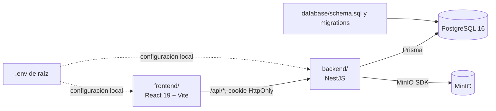

# Arquitectura del monorepo

## Diagrama

En producción, Vite publica el frontend compilado detrás del host de la API o de un proxy inverso; ese proxy dirige `/api/*` a NestJS. En desarrollo, el servidor Vite local aplica el mismo enrutamiento desde `BACKEND_URL`. El navegador no conoce credenciales de PostgreSQL/MinIO ni se conecta directamente a esos servicios.

## Carpetas

- `frontend/`: React, rutas por rol, estilos, estado y servicios HTTP. Los componentes no conocen Prisma, SQL ni MinIO.
- `backend/`: aplicación NestJS; `modules/` separa dominios, `common/` contiene autenticación, guards e infraestructura, y Prisma mapea el esquema SQL.
- `database/`: `schema.sql` para instalación limpia, `seed.sql` de demostración y migraciones SQL aditivas.
- `docker-compose.yml`: PostgreSQL, MinIO, inicialización de bucket y API NestJS. El frontend Vite se ejecuta aparte durante desarrollo.
- `docs/` y `contexto/`: contratos operativos, decisiones de arquitectura y flujos institucionales.

## Migración de rutas de Vite a NestJS

La API temporal `frontend/src/server/apiPlugin.ts` organiza rutas en bloques; NestJS las separa por módulo. Esta tabla sirve para completar la transición y borrar el plugin una vez comprobado el contrato en producción.

| API temporal (`frontend/src/server/queries/`) | NestJS |
| --- | --- |
| `auth.ts`, `registrationRequests.ts` | `backend/src/modules/auth/` (registro, login, solicitudes y sesión) |
| `users.ts` | `backend/src/modules/users/` (listados y perfiles) |
| `submissions.ts` y almacenamiento | `backend/src/modules/submissions/` |
| `assignments.ts` | `backend/src/modules/admin/` |
| `reviews.ts` | `backend/src/modules/reviews/` |
| `stratifications.ts` | `backend/src/modules/stratification/` |
| `qualifications.ts` | `backend/src/modules/qualification/` |
| `annexes.ts`, generación DOCX | `backend/src/modules/annexes/` y `backend/src/common/annexes/` |
| `adminResearch.ts` | `backend/src/modules/admin/` |

## Datos y seguridad

Los contratos `/api/*` y los nombres que esperan `frontend/src/services/` se mantienen estables durante la migración. NestJS obtiene los datos con Prisma sobre las tablas existentes. Los cambios de esquema se escriben primero como nueva migración SQL y se reflejan en `database/schema.sql`; no se reescribe una migración ya aplicada.

La autenticación usa contraseña scrypt y cookie firmada HttpOnly. Los guards cargan el rol vigente de PostgreSQL y aplican permisos de ruta; los servicios comprueban además pertenencia a una asignación antes de servir datos o documentos. `CORS_ORIGIN`, `DATABASE_URL`, `SESSION_SECRET` y las credenciales MinIO se configuran desde el entorno, nunca desde variables `VITE_*` públicas.

## Convenciones de módulos

Un controlador define rutas y valida DTOs; un servicio aplica reglas del flujo; Prisma queda en servicios del backend. Mantén respuestas compatibles con los servicios React, reporta errores HTTP claros y evita devolver hashes de contraseñas. Toda consulta de recursos institucionales debe revisar usuario, rol, asignación y estado del flujo.

## Ramas y revisión

Usa ramas `feature/`, `fix/` o `docs/` desde la rama base acordada por el equipo. En el PR describe el issue, alcance, migraciones si las hay y las comprobaciones realizadas. Revisa cambios de frontend/backend juntos si modifican un contrato; los cambios de experiencia visual pueden ir en un PR independiente sin bloquear la API.
